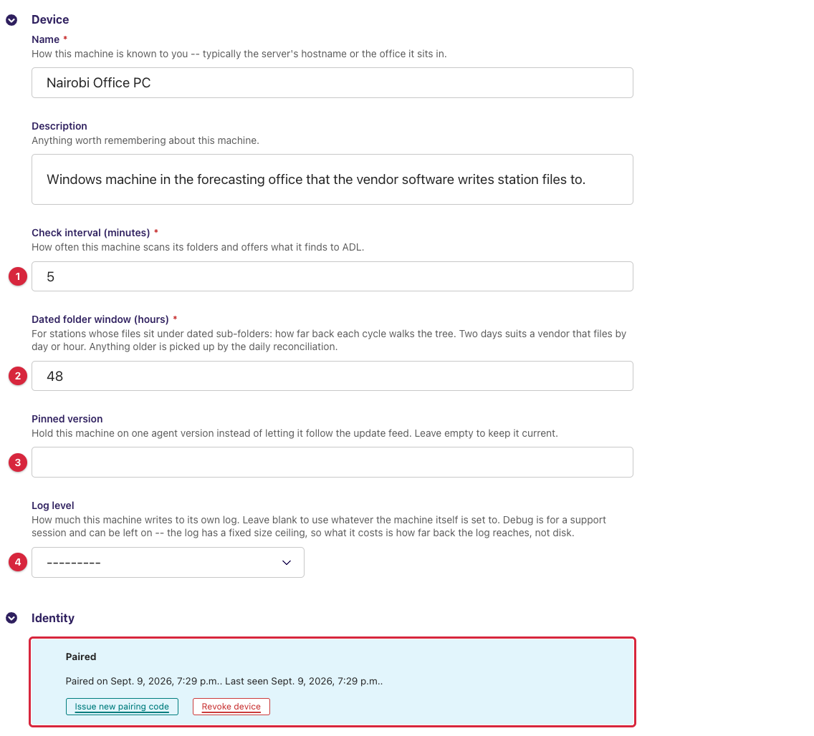
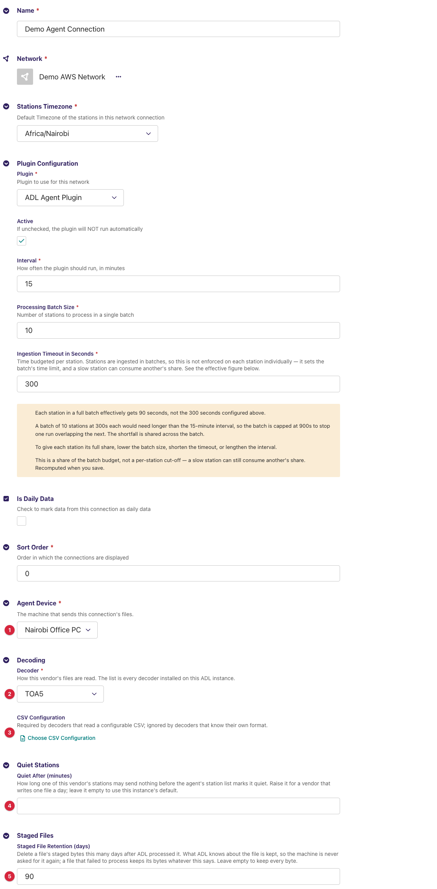
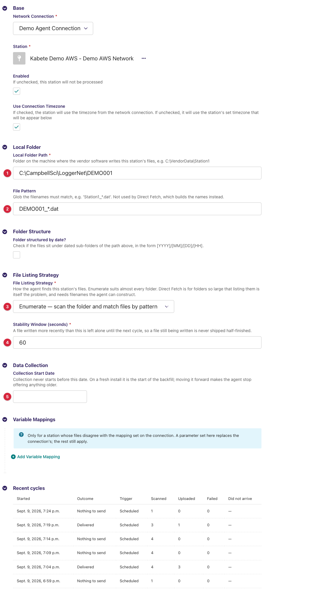
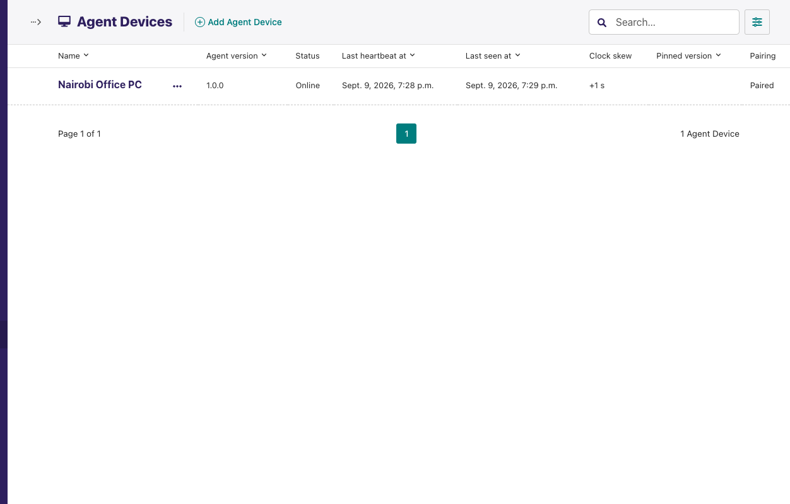
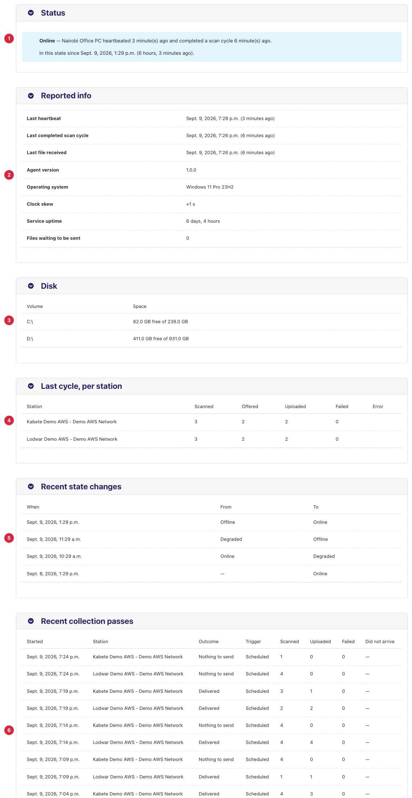
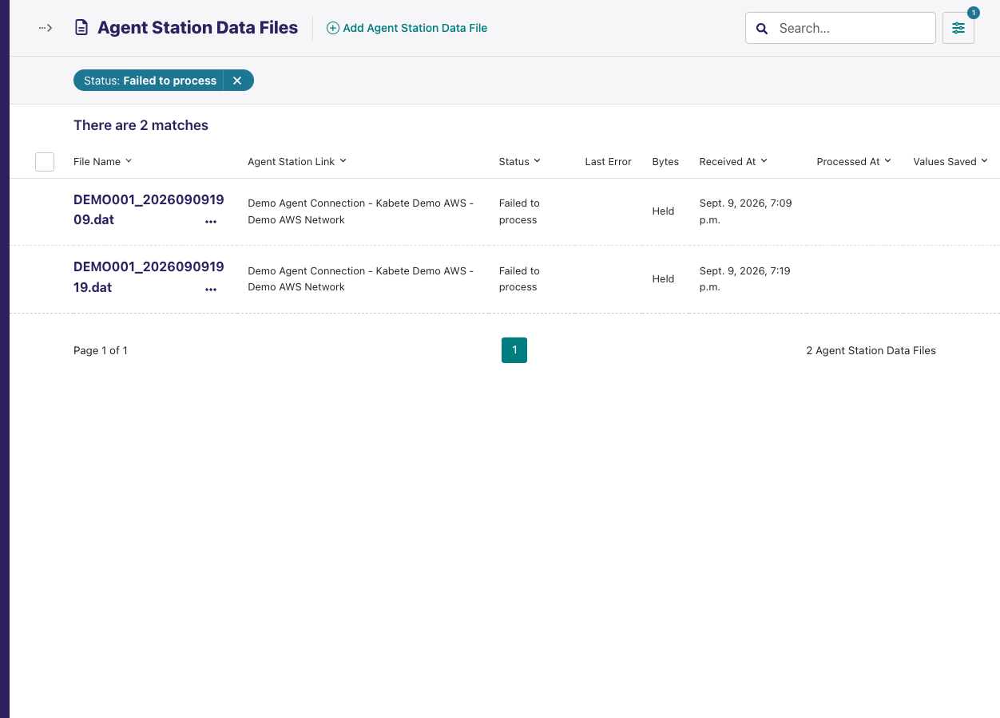
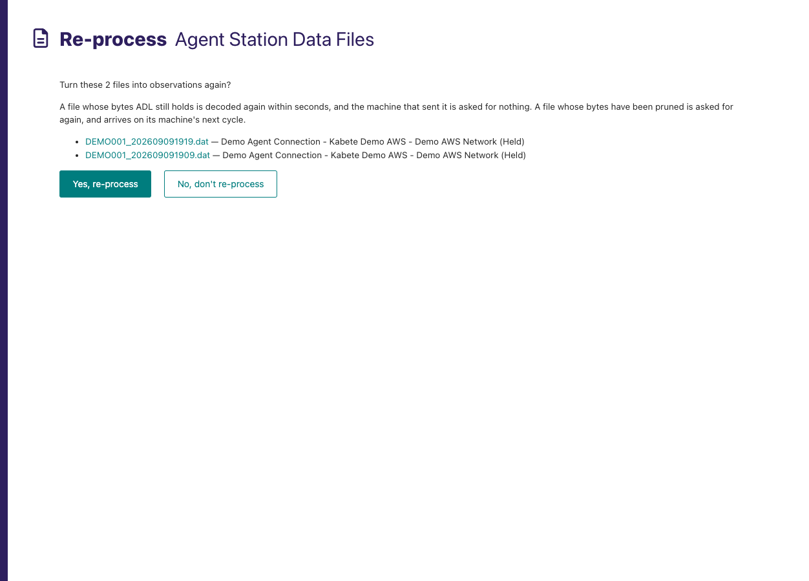
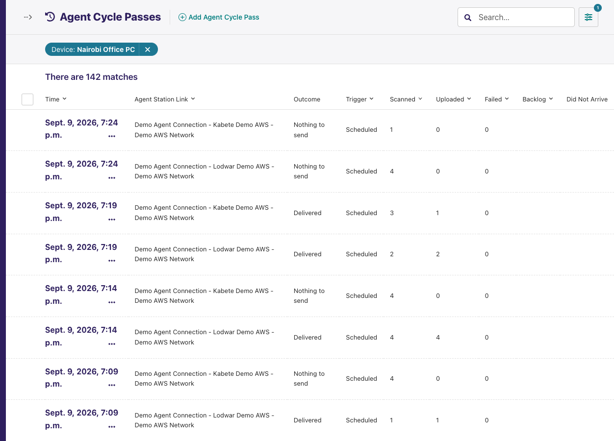
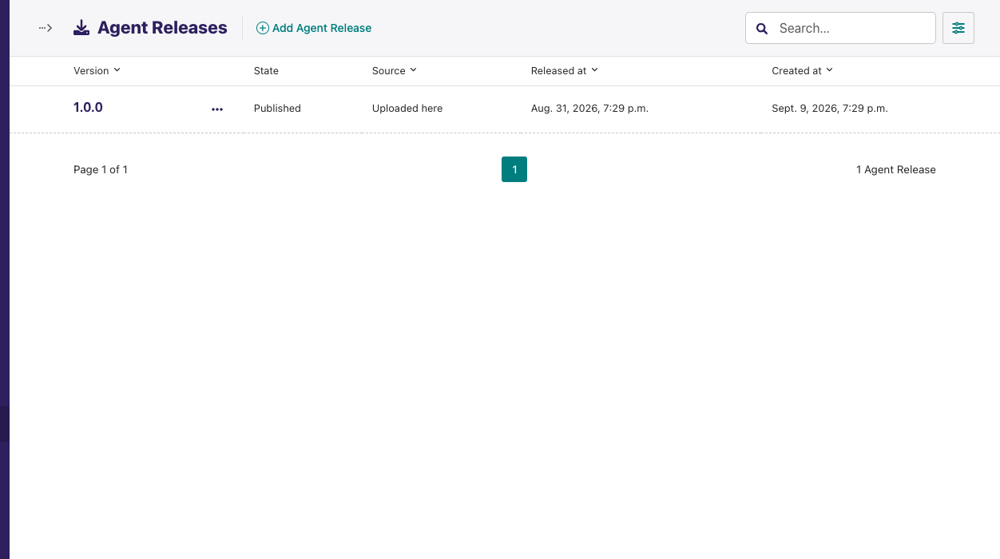
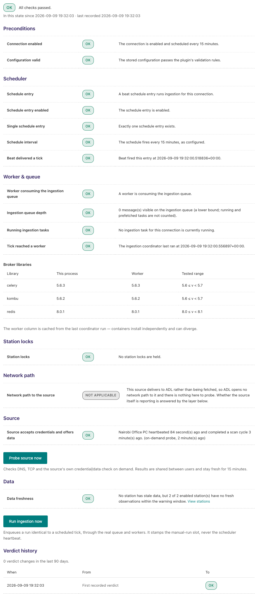

---
adl_plugin:
  name: ADL Agent Plugin
  connects_to: The ADL Agent Windows application, pushing station files over HTTPS
  category: general
  choose_when: The server holding your station files has no public address or inbound port, so ADL cannot dial in to fetch them.
---
# ADL Agent Plugin

The server side of the **ADL Agent**, the Windows application an NMHS
installs on the machine where its station software writes files, so that the
machine **pushes** those files out to ADL over HTTPS instead of ADL dialling
in. This plugin is what those pushes arrive at: the API the agents call, the
admin pages an operator manages them from, the staging store their files
land in, and the drain that decodes staged files into observations — using
the [ADL FTP Plugin](https://github.com/wmo-raf/adl-ftp-plugin)'s decoders,
so every country-specific decoder written for FTP works unchanged.

**Repository:** [adl-agent-plugin](https://github.com/wmo-raf/adl-agent-plugin) · the Windows application lives in [adl-agent](https://github.com/wmo-raf/adl-agent)
**Plugin type identifier:** `adl_agent_plugin`
**Connection model:** `AgentConnection` · **Station link model:** `AgentStationLink`
**Other models:** `AgentDevice` (one paired machine) · `AgentStationDataFile` (the file ledger) · `AgentCyclePass` (collection history) · `AgentRelease` (agent update packages)

> **About the screenshots.** Every image in this guide is regenerated from
> `docs/screenshots.yml` against a seeded demo instance, so device names,
> folder paths, station names and readings in them are placeholders — not
> values to copy. The field tables are the reference for what to enter.

## Overview

Direction is inverted compared with every other ingestion plugin, so the
mental model is different too:

```
country server ── ADL Agent (Windows service) ──HTTPS──▶ ADL: /plugins/api/agent/v1/
   vendor folders      pair · sync · heartbeat                  │
                       manifest · files                         ▼
                                              file ledger + staged bytes (AgentStationDataFile)
                                                                │  drain (FTP plugin decoders)
                                                                ▼
                                          records ──▶ variable mappings ──▶ ADL observations
```

| Object | What it is | Where |
|---|---|---|
| **Agent Device** | One installed agent — one machine in one country. Holds the pairing code, the device token digest, the machine's scan cadence, the version pin, and what the machine last reported (heartbeat). | Settings → ADL Agent → Agent Devices |
| **Agent Connection** | One vendor's data on one machine: which device sends it, which decoder reads the files, staged-file retention, connection-wide variable mappings. A machine hosting two vendors' software gets two connections on one device. | Connections |
| **Agent Station Link** | One ADL station bound to one folder on that machine — the folder path, file pattern and listing strategy the agent scans, plus per-station mapping overrides. Its *app tier* is writable from the agent's own screen. | Connections → station links |
| **Agent Station Data File** | The ledger: one row per file per station, remembering name, size, mtime and hash (so the machine is never asked for the same bytes twice), the staged bytes, and what ADL made of them. | Snippets → Agent Station Data Files |
| **Agent Cycle** | One station's share of one folder scan the agent finished — what it saw, offered, uploaded, and which files it saw that never arrived. | Snippets → Agent Cycles |
| **Agent Release** | An agent installer version this instance offers its fleet, uploaded or mirrored. | Settings → ADL Agent → Agent Releases |

One cycle on the machine: **sync** (read its whole configuration in one
call), **scan** each station's folder, **manifest** (offer what it sees; ADL
answers with the files it does not hold), **upload** those one by one, and
every five minutes independently a **heartbeat**. On ADL: an upload nudges
the connection to **drain** within seconds; Celery Beat drains on the
connection's interval as the safety net; a sweep every minute turns the
fleet's silence into *degraded* / *offline* verdicts.

## Prerequisites

- A running ADL instance (see [ADL installation](https://adl-tool.readthedocs.io/en/latest/installation.html))
  reachable from the country server over **HTTPS** — its public URL is what
  the agent is installed with. The agent needs nothing but that one URL.
- The **ADL FTP Plugin, 0.12.0 or later**, installed on the same instance,
  plus whichever country decoder plugins the vendor files need. This plugin
  ships no decoders and does not load without the FTP plugin.
- Storage for staged files: Django's default storage (the container's disk
  by default; MinIO/S3 through a storage class if the instance is configured
  so). Budget roughly a quarter's worth of the country's files (see
  *Retention*).
- The TimescaleDB backend (`timescalegis`), which ADL core already requires;
  the cycle-history table is a hypertable.
- On the country server: Windows, the ADL Agent installer, and a technician
  who can type a pairing code.

## Installation

Installed like any ADL plugin — see [Plugin Installation](https://adl-tool.readthedocs.io/en/latest/developer_guide/plugins/plugin_installation.html)
for all methods. The FTP plugin must be listed first:

```toml
[[plugins]]
name = "ADL FTP Plugin"
git  = "https://github.com/wmo-raf/adl-ftp-plugin.git"
tag  = "0.13.0"

[[plugins]]
name = "ADL Agent Plugin"
git  = "https://github.com/wmo-raf/adl-agent-plugin.git"
tag  = "0.6.0"
```

After rebuild/restart, confirm it appears in `docker compose exec adl
list-plugins`, that **Agent Connection** is offered when adding a connection,
and that *Settings → ADL Agent* is in the admin sidebar.

### Deployment settings

All optional, read from the environment (or Django settings), with defaults
that suit a first deployment:

| Setting | Default | What it is for |
|---|---|---|
| `ADL_AGENT_HEARTBEAT_INTERVAL_MINUTES` | 5 | How often each machine heartbeats. Handed to the agents in every sync, so a change reaches the fleet without reinstalling. |
| `ADL_AGENT_DEGRADED_AFTER_MISSED` / `ADL_AGENT_OFFLINE_AFTER_MISSED` | 2 / 3 | Missed heartbeats before a machine is called *Degraded* / *Offline*. |
| `ADL_AGENT_CYCLE_STUCK_MULTIPLIER` | 2 | A machine heartbeating but neither finishing a scan nor delivering a file for this many of its check intervals is *Cycle stuck*. |
| `ADL_AGENT_CLOCK_SKEW_ADVISORY_SECONDS` | 300 | Clock difference above which the skew is written beside the state. |
| `ADL_AGENT_STATION_STALE_AFTER_MINUTES` | 360 | How long a station may deliver nothing before the agent's own station list marks it quiet; a connection may raise it (below). |
| `ADL_AGENT_RECONCILIATION_INTERVAL_HOURS` | 24 | How often a station offers its whole folder back to its collection start date instead of the cheap recent scan. `0` switches sweeps off. |
| `ADL_AGENT_CONCURRENT_UPLOADS` | 4 | Files one machine may upload at once, across all its stations (clamped to 32). |
| `ADL_AGENT_PAIR_THROTTLE_RATE` | `30/hour` | Pairing attempts per client IP. |
| `ADL_AGENT_CYCLE_COMPRESS_AFTER_DAYS` / `ADL_AGENT_CYCLE_RETENTION_DAYS` | 7 / 90 | Compression and retention of the Agent Cycles history table; re-applied nightly. |
| `ADL_AGENT_RELEASE_MIRROR_ENABLED` | `false` | Whether this instance pulls agent releases from upstream nightly (see *Agent Releases*). |
| `ADL_AGENT_RELEASE_INDEX_URL` / `ADL_AGENT_RELEASE_MIRROR_LIMIT` / `ADL_AGENT_RELEASE_MAX_BYTES` | the `adl-agent` project's latest release / 3 / 300 MB | Where releases are mirrored from, how many to consider, and the largest package accepted. |

## Enrolling a machine: Agent Devices

Before any connection can exist, the machine must be a device. Go to
**Settings → ADL Agent → Agent Devices → Add**:

| Field | Required | Default | Description |
|---|---|---|---|
| Name | yes | — | How you know the machine — usually its hostname or the office it sits in. Unique. |
| Description | no | — | Anything worth remembering about it. |
| Check interval (minutes) | yes | 5 | How often the machine scans its folders and offers what it finds. One loop per machine covers every folder it serves. Minimum 1. |
| Dated folder window (hours) | yes | 48 | For stations whose files sit under dated sub-folders: how far back each ordinary scan walks the tree. Anything older is picked up by the daily reconciliation. `0` means the current folder only. |
| Pinned version | no | empty | Hold this machine on one agent version (three numbers, e.g. `1.2.0`) instead of letting it follow the update feed. |
| Log level | no | empty | Make the machine write more (or less) to its own log: *Trace*, *Debug*, *Information*, *Warning*, *Error*. Empty leaves the machine's local setting alone. *Debug* is safe to leave on — the log has a fixed size ceiling. |



The Identity panel above shows a machine that is already paired. On a new
device it instead shows the **pairing code** to type into the agent, with its
expiry — it works once, and only once. *Issue new pairing code* produces a
fresh one, which is also how a machine that has lost its token is let back
in.

Saving a new device mints its first **pairing code** (`XXXX-XXXX`, letters
and digits that cannot be confused when read out; valid 72 hours; single
use), shown in the **Identity** panel of the device's edit form. The
technician types it into the ADL Agent installer on the machine, which trades
it for a long-lived device token. ADL stores only a digest of the token and
never shows it.

The Identity panel states which of four states the device is in — *Awaiting
pairing*, *Paired*, *Revoked*, *Not paired* — and offers two actions, each
with its own confirmation page:

- **Issue pairing code** / **Issue new pairing code** — enrollment, and also
  token rotation: the current token keeps working until the new code is
  redeemed, then stops.
- **Revoke device** — destroys the token and any unused code at once; every
  call the machine makes answers `401` and the agent tells the technician to
  re-pair. Letting it back in means issuing a new code. Both actions need
  *change* permission on devices.

A device that has connections cannot be deleted; revoke it instead, which
keeps the country's folder configuration.

## Connection configuration

In the ADL admin go to **Connections → Add**, choose **Agent Connection**, and
fill in the base fields (name, network, plugin processing enabled and
interval, stations timezone …) as described in
[Manage Connections](https://adl-tool.readthedocs.io/en/latest/user_guide/manage_connections.html).
The *interval* is how often the safety-net drain runs; uploads trigger a
drain within seconds regardless. Plugin-specific fields:

| Field | Required | Default | Description |
|---|---|---|---|
| Agent Device | yes | — | The machine that sends this connection's files. |
| Decoder | yes | — | How this vendor's files are read, from the FTP plugin's decoder list — standard CSV, TOA5, and every decoder plugin installed on this instance. See [Choosing a decoder](https://github.com/wmo-raf/adl-ftp-plugin/blob/main/docs/guide.md#choosing-a-decoder). |
| CSV Configuration | when the decoder needs one | — | The FTP plugin's *CSV Decoder Configuration* for the standard CSV decoder; ignored by decoders that know their format. Saving a decoder that needs one without it fails with `A CSV configuration is required by the '<decoder>' decoder.` |
| Quiet After (minutes) | no | empty → instance default (360) | How long one of this vendor's stations may send nothing before the agent's own station list marks it quiet. Raise it for a vendor that writes one file a day. |
| Staged File Retention (days) | no | 90 | Delete a file's staged bytes this many days after ADL processed it. The ledger row stays, so the machine is never asked for the file again; failed files keep their bytes. Empty keeps every byte. |
| Variable Mappings | yes | — | How this vendor's file columns map onto ADL parameters; serves every station on the connection unless a station overrides a parameter (Pattern C, as the FTP plugin). |



Pausing a connection (*plugin processing enabled* off) stops its files being
**processed**, not arriving: uploads are still accepted and staged, and the
backlog drains when processing is switched back on.

### Connection variable mappings

| Field | Description |
|---|---|
| ADL Parameter | The ADL `DataParameter` the values are stored under. |
| File Variable Name | The key the decoder emits for the column — the header text for CSV-like decoders, the decoder's own name for fixed-layout ones. |
| File Variable Unit | The unit the file states the variable in; ADL converts to the parameter's unit. |

## Station link configuration

For each station, go to **Connections → the connection → Station Links →
Add** and create an **Agent Station Link**. Every field below except the
*Data Collection* and *Variable Mappings* groups is the **app tier**: the
technician at the machine can change it from the agent's own screen, and the
last write from either side wins. Base fields (station, enabled, timezone
override …) are the core's.

| Field | Required | Default | Description |
|---|---|---|---|
| Local Folder Path | yes | — | Folder **on the machine** where the vendor software writes this station's files, e.g. `C:\VendorData\Station1`. |
| File Pattern | for *Enumerate* | — | Glob the file names must match, e.g. `Station1_*.dat`. |
| Folder structured by date? / Date Granularity / Month folder format | no | off / — / `01`–`12` | Whether the files sit under dated sub-folders `[YYYY]/[MM]/[DD]/[HH]` of the path, how deep, and how the month folder is written. Granularity is required when the box is ticked. |
| File Listing Strategy | yes | Enumerate | **Enumerate** scans the folder and matches by pattern — right for almost every folder. **Direct Fetch** builds the expected file names from a prefix, an interval and a datetime format, for folders so large that listing them is the problem. |
| Stability Window (seconds) | yes | 60 | A file written more recently than this is left alone until the next cycle, so a file still being written is never shipped half-finished. |
| File Prefix / File Datetime Format / File Interval (minutes) / File Datetime Timezone / File Extension | for *Direct Fetch* | — / — / — / UTC / `.txt` | The name recipe: for `STATION_001_20260219122000.txt` the prefix is `STATION_001_`, the format `yyyyMMddHHmmss`, the interval the minutes between files. Prefix, format and interval are required under Direct Fetch. |
| Collection Start Date | no | empty | Collection never starts before this date. On a fresh install it is the start of the backfill — the agent offers every file back to it; moving it forward makes the agent stop offering anything older. Must be in the past. |
| Variable Mappings | no | — | Only for a station whose files disagree with the connection's mapping; a parameter set here replaces the connection's, the rest still apply. |



The form ends with a read-only **Recent cycles** panel (see *Admin UI*). The
station link list shows *Local folder path*, *File pattern* and *Listing
strategy* as columns, so a country's folder setup can be read off the list.

## Admin UI added by this plugin

### Entry points

| Where | Element | Goes to |
|---|---|---|
| Admin sidebar → **Settings → ADL Agent** | *Agent Devices*, *Agent Releases* | The two administrative listings. |
| Admin sidebar → **Snippets** | *Agent Station Data Files*, *Agent Cycles* | The file ledger and the collection history. |
| Agent Devices list | **Inspect** on a row | The device info page. |
| Network Connections list | **Device info** on an Agent Connection row | The same device info page, for the machine behind that connection. |
| Agent Device edit form | **Issue pairing code**, **Revoke device** | Confirmation pages for the two credential actions. |
| Agent Station Data Files list | **Re-process** bulk action | Confirmation page listing the ticked files and the route each will take. |

### Agent Devices — the fleet view

`Settings → ADL Agent → Agent Devices` doubles as the fleet view. One row per
machine: **Name**, **Agent version** (from the header every call carries),
**Status** (the liveness verdict), **Last heartbeat at**, **Last seen at**
(any call, not only heartbeats — a machine mid-upload between heartbeats is
not silent), **Clock skew** (signed seconds, machine minus ADL), **Pinned
version**, **Pairing** (the credential state). Filter by liveness state;
search by name or version.



### Device info page

Reached from a device's **Inspect** button or a connection's **Device info**.
Five read-only cards, everything the machine last reported:

1. **Status** — the verdict in colour with its sentence (`Songea server has
   missed 3 heartbeats -- last heard from 17 minute(s) ago, and one is
   expected every 5 minutes.`), since when, and a clock-skew note when the
   skew is worth mentioning.
2. **Reported info** — last heartbeat, last completed scan cycle, last file
   received, agent version, operating system, clock skew, service uptime,
   files waiting to be sent, and (only when non-zero) *Collection passes never
   received* — how many scans the machine had to drop while it could not
   reach ADL.
3. **Disk** — free and total space per volume the machine watches.
4. **Last cycle, per station** — scanned / offered / uploaded / failed and
   the agent's error text for each station, from the last heartbeat.
5. **Recent state changes** — the last ten liveness transitions, newest
   first.
6. **Recent collection passes** — the last ten Agent Cycles rows for this
   machine, linking to the filtered listing.



### Agent Station Data Files — the ledger

`Snippets → Agent Station Data Files`, 50 per page, searchable by file name,
filterable by station link and status. Columns:

| Column | Meaning |
|---|---|
| File name / Agent Station Link | Which file, for which station. One row per name, for the life of that name; a file that grows comes again in full and updates the row in place. |
| Status | *Received — waiting to be processed*, *Processed*, or *Failed to process*. |
| Last Error | The first line of the decoder's message for a failed file; the whole text is on the row's inspect page. Credentials are redacted at write time. |
| Bytes | *Held* (staged bytes present), *Pruned* (dropped by retention; the ledger row and hash remain), or *Awaiting re-send* (ADL has asked the machine for the bytes again). |
| Received at / Processed at / Values saved | When it arrived, when its records were persisted, and how many observation values reached the database — `0` means it decoded but nothing was kept, typically a mapping or window problem. |



### Re-process

Tick rows on the ledger listing and choose **Re-process** in the bulk-action
bar. The confirmation page lists each file with its station and bytes state
and explains the route it will take:

- **Bytes held** — ADL decodes the file again within seconds; the machine is
  asked for nothing. This is how a decoder or mapping fix reaches files that
  already arrived, including *failed* ones.
- **Bytes pruned** — ADL forgets the file's hash, the machine offers it on
  its next scan and is told to send it. The request widens the station's
  scan window down to that file for a week, then lapses (press Re-process
  again to re-arm).

Success reads `2 files are being decoded again. 1 file has been asked for
again, and arrives on its machine's next cycle.` Needs *change* permission on
the files.



### Agent Cycles — collection history

`Snippets → Agent Cycles`: one row per station per folder scan the machine
finished, kept 90 days. Columns: **Time** (when the scan started, the
machine's clock), **Agent Station Link**, **Outcome** (*Delivered*, *Nothing
to send*, *Files failed*, *Cut short*), **Trigger** (*Scheduled*,
*Reconciliation sweep*, *Collect now*), **Scanned**, **Uploaded**, **Failed**,
**Backlog**, and **Did Not Arrive** — up to three names of files the scan saw
that ADL never received, each tagged *failed*, *still being written*, or
*matches no station*. That last tag is what shows "the vendor renamed its
files" as something other than silence. Filter by device, station, trigger,
outcome and date range; a dash in a count means the machine did not report
it, `0` means it looked and found nothing.



### Agent Releases

`Settings → ADL Agent → Agent Releases`: the agent versions this instance can
offer its fleet. Columns: **Version**, **State** (*Published* or *Staged*),
**Source** (*Uploaded here* or *Mirrored from upstream*), **Released at**,
**Created at**. A release holds one **Package** per install tier — *Windows
Installer package* (service-tier upgrade), *Velopack release* (per-user
upgrade), *Velopack installer* (first install) — each with an optional
**Expected SHA-256**: paste the digest the build published and the upload
refuses itself unless the bytes match (`These bytes hash to …, not …. The
upload is not the package that digest describes.`). Only a **Published**
release is offered; a mirrored one arrives staged so each country decides
when its machines move. A device's *Pinned version* holds that one machine
on a version while the fleet moves.



## Data collection behavior

**Files: propose, send, remember.** Each scan the agent offers what it sees
(name, size, mtime, sha-256) in one manifest call for the whole machine —
at most 500 files per call, paged beyond that. ADL diffs each against the
ledger and answers with the ones to send: a name never held, a name whose
hash differs (a grown daily file), or a name whose hash was cleared by a
re-process. Nothing is written by a manifest, so a scan that dies between the
manifest and the uploads changes nothing. Each upload carries its entry
again; ADL hashes the bytes as they arrive (50 MB cap, gzip accepted) and
refuses a size or hash mismatch — the file is simply offered again next
scan. Stations switched off in ADL take no files; a station link the device
no longer owns is reported back rather than raised.

**The watermark.** Each station link tells the agent the oldest file worth
offering: the *Collection Start Date*, pulled further back only by an
outstanding re-send request. It is a floor and never a high-water mark, so
a file backfilled into a folder weeks late still arrives. Once every
reconciliation interval the agent offers everything back to the floor.

**The drain.** A scheduled run and a nudged run are the same run: for each
station, every ledger row in *received* order (oldest mtime first) is decoded
with the connection's decoder, its records handed to ADL, and the row stamped
once ADL has persisted them:

| Outcome | Status | Recorded |
|---|---|---|
| Decoded, records saved | *Processed* | *Processed at*, *Values saved* |
| Decoded, nothing mapped or all outside the window | *Processed* | *Values saved* = 0 |
| Would not decode | *Failed* | *Last error* — the decoder's own message. Not retried until re-processed or the file comes again changed. |
| Bytes unreadable (storage down) | stays *Received* | a log line; retried next run |
| No decoder on the connection, or its plugin not installed | stays *Received* | a log line; choosing a decoder drains the backlog |

One bad file costs only itself. The window ADL resolves still applies to
what comes out of a file: a record older than the collection start date, or
than what ADL already holds, is rejected as from any source.

**Retention.** Nightly at 01:00 the staged bytes of *processed* files older
than the connection's retention are deleted; rows stay, failed and waiting
files are never pruned, and a connection with no retention period keeps
everything. State transitions and cycle rows are dropped after 90 days.

**Timezones:** a decoded record is stamped like an FTP-decoded one — by the
decoder's own rules and the station's timezone. File mtimes and heartbeat
times are read as UTC when the agent sends none.

## Source checks / diagnostics

### Where check results appear

The connection's **Ingestion Diagnostic** page (Connections list → *Health*
column) shows a ladder with two layers this plugin answers unusually:

- **Layer 4, Network path** reports *not applicable* — ADL dials nothing;
  the traffic runs the other way. The same declaration stops a completed
  drain (a sweep of the staging store) being read as evidence that the
  machine is alive.
- **Layer 5, Source** is the machine's liveness, read from its heartbeats.
  It is published by the minute sweep, so the verdict is **on the page
  without pressing anything**; *Probe source now* re-reads it instantly (no
  I/O is involved).



The station link's **Inspect** page shows *Collection Status* and no
*Station Source Check* panel; a station's health is read from the *Recent
cycles* panel and the Agent Cycles listing instead. How to read the core
screens is covered in
[Monitoring & Diagnostics](https://adl-tool.readthedocs.io/en/latest/user_guide/monitoring_and_diagnostics.html).

### What each check verifies

| Check | What it verifies |
|---|---|
| Source (this plugin) — the liveness ladder | *Unknown*: the device is not paired (or revoked). *Offline* / *Degraded*: 3 / 2 heartbeat intervals without a heartbeat (from pairing time if it never heartbeated). *Cycle stuck*: heartbeats fresh, but for over 2× the check interval neither a scan completed nor a file arrived. *Online* otherwise — including a machine that has not finished a scan for hours because it is uploading a backlog, which says so in its sentence. Silence outranks stuckness; clock skew is a note beside the state, never the state. |

### Feedback catalogue — messages this plugin produces

Liveness sentences appear on the device info page, the fleet listing tooltip
and the diagnostic's source layer; API refusals reach the technician through
the agent's own screen and log; drain messages land in the activity/task log
and the ledger row.

| Message (example) | Status | Meaning | What to do |
|---|---|---|---|
| `Songea server heartbeated 2 minute(s) ago and completed a scan cycle 4 minute(s) ago.` | Online | Healthy. | — |
| `Songea server is sending files -- the last arrived 3 minute(s) ago -- but has not finished a scan cycle for 6 hour(s). That is what a machine working through a backlog looks like; it finishes a cycle once it has been round every station.` | Online | A first bind with history behind it. | Wait. |
| `Songea server has missed 2 heartbeats -- last heard from 11 minute(s) ago, and one is expected every 5 minutes.` | Degraded (FAILED) | Two intervals of silence — a dropped link or a restarting service. | Watch; it becomes *Offline* at three. |
| `Songea server has missed 3 heartbeats -- last heard from 17 minute(s) ago, …` / `… has not heartbeated since it was paired 2 day(s) ago; one is expected every 5 minutes.` | Offline (FAILED) | The machine, its link or the service is down; or it was paired but the service never started. | Someone at the machine: is the service running, can it reach ADL's URL? |
| `Songea server is heartbeating but its last completed scan cycle was 3 hour(s) ago and nothing has arrived from it since; it scans every 5 minutes.` | Cycle stuck (FAILED) | The service lives; its work does not — a folder that is not there, a share that unmounted, a wedged scan. | Read the device page's *Last cycle, per station* errors and the Agent Cycles rows. |
| `Songea server is not paired, so no machine is sending anything for this connection.` | Unknown (FAILED) | No token exists — never paired, or revoked. | Issue a pairing code and pair the machine. |
| `Its clock is 12 minute(s) ahead of ADL's. File windows are computed from the machine's own file times, so a skewed clock quietly loses observations.` | note beside the state | Skew above the advisory threshold. | Fix the machine's clock (NTP). |
| `No decoder is set on connection <name>. Its files are being received and staged, but nothing can read them until one is chosen.` | task log (error) | Files arrive, none are processed. | Choose a *Decoder* on the connection. |
| `Decoder kcsap on connection <name> could not be resolved: …` | task log (error) | The named decoder's plugin is not installed on this instance. | Install the decoder plugin. |
| `Could not read the staged bytes of DEMO_0220.csv: … Leaving it to be picked up again once storage is healthy.` | task log (error) | The storage backend is down or the object is gone. | Fix storage; the row stays *received* and drains next run. |
| `ValueError: could not convert string to float: 'NAN'` (as *Last error*) | ledger row, Failed | The decoder's exception for a file it could not read. | Fix the decoder or CSV configuration, then **Re-process** the failed rows. |
| `File DEMO_0220.csv decoded 144 record(s) but none of its values were saved — check the variable mappings and the ingestion window` | task log (warning); *Values saved* 0 | Decoded, nothing kept. | Check the mappings' *File Variable Name*s and the collection start date. |
| `That pairing code is not recognised. Ask your ADL administrator to issue a new one.` / `That pairing code has expired. Ask your ADL administrator to issue a new one.` | agent screen (400) | Mistyped, already used, or older than 72 hours. | Re-read the code; issue a new one. |
| `Invalid or revoked device token.` | agent screen (401) | The device was revoked (or rotated and the old token used). | Issue a new pairing code; re-pair. |
| `This station is switched off in ADL and is not taking files.` | agent log (409 `station_link_disabled`) | The agent uploaded for a station disabled centrally, from a cached configuration. | Nothing; it re-reads on its next sync. |
| `The file is 1024 bytes, not the 980 it was offered as. It was probably still being written.` / `The file does not hash to what it was offered as. It probably changed while it was being read; offer it again next cycle.` | agent log (400) | The file changed between scan and upload. | Nothing; raise the station's *Stability Window* if it recurs. |
| `Files must be at most 52428800 bytes.` | agent log (413) | A file over 50 MB. | Vendor files are kilobytes; a file this size is a misconfiguration on the machine. |
| `Offer at most 500 files per manifest, in pages.` | agent log (400) | An agent too old to page offered a huge folder. | Update the agent. |
| `local_folder_path is managed in the ADL admin and cannot be set from the app` / `foo is not a station link setting` | agent screen (400 `read_only_fields`) | The app tried to write an admin-tier or unknown field. | Change that field in the ADL admin. |
| `A file pattern is required when the agent scans the folder.` / `A file prefix is required for Direct Fetch — it is how the agent builds the filename.` / `Say how far down the dated folder tree the files sit.` | station link form (or 400 `invalid_config` from the app) | Validation. | Fill the field. |
| `This device is pinned to 1.1.0, which this ADL instance does not hold as a published release.` | update feed `reason` | A pin names a version this instance has not got. | Upload/publish that release, or clear the pin. |
| `Release 1.2.0 has no package for a user-tier install.` | update feed `reason` | The release was published with only one tier's package. | Add the missing package. |
| `[AGENT RELEASES] Did not mirror 1.2.0: the msi package hashes to …, not the … the index states` | worker log | The mirror refused a package whose bytes did not match the index. | Transient or an upstream problem; nothing is stored. |

## Troubleshooting

**A device stays *Awaiting pairing* after the technician typed the code**
: The agent could not reach the instance's URL, or the code was typed after
  its 72 hours. Check the agent's log on the machine; issue a new code.

**Files arrive (ledger rows *Received*) but never become observations**
: The connection has no decoder, or its decoder plugin is not installed —
  see the two `task log` rows above. Pausing the connection also holds files
  at *Received* by design.

**Every file of a station is *Failed* with the same error**
: The decoder or CSV configuration does not match the vendor's files. Fix
  it, filter the ledger to the station's failures, tick them, **Re-process**.

**A station is quiet and the agent shows it as quiet, but the machine is Online**
: Look at Agent Cycles for that station: *Did Not Arrive* names files that
  matched no station (the vendor renamed its output — fix the *File
  Pattern*) or files held as still being written (a vendor that keeps the
  file open — raise nothing, or lower the *Stability Window*).

**The machine is called *Cycle stuck* every night**
: A scan that legitimately takes longer than 2× the check interval (a huge
  dated tree). Raise the device's check interval, lower its *Dated folder
  window*, or raise `ADL_AGENT_CYCLE_STUCK_MULTIPLIER`.

**Disk on the ADL host fills with staged files**
: Lower *Staged File Retention (days)* on the busy connections; the nightly
  sweep prunes bytes of processed files older than that. Failed files are
  never pruned — re-process or delete their rows once the cause is fixed.

**A re-processed pruned file never comes back**
: The vendor rotated it away, or the request lapsed after a week. A machine
  that can still see the file is told to send it on its next scan; press
  Re-process again to re-arm the widened window.

**Agents do not update**
: No release is *Published*, the device is pinned, or mirroring is off and
  nothing was uploaded. Check *Agent Releases* and the device's pin.

## Compatibility

| Plugin version | Requires | Notes |
|---|---|---|
| 0.6.0 | ADL core >= 0.8.14, ADL FTP Plugin >= 0.12.0, `timescalegis` database backend | Current release. Device info as an inspect page. Ships migrations `0001`–`0014`; `0014` sets TimescaleDB policies on the cycle table. |
| 0.5.0 | as above | Collection history (Agent Cycles), per-deployment upload concurrency, device log level. |
| 0.4.0 | as above | "Cycle stuck" narrowed to *no progress* (files arriving count). |
| 0.3.0 | as above | Reconciliation interval and dated folder window; Settings → ADL Agent menu. |
| 0.2.0 | as above | First tagged release. |

Agents and ADL instances are upgraded independently; every field the agent
reads is optional in both directions, so mixed versions are the normal state.
See the repository's `CHANGELOG.md` for the upgrade notes of each release.

## Changelog

See [GitHub Releases](https://github.com/wmo-raf/adl-agent-plugin/releases)
and `CHANGELOG.md` in the repository.
